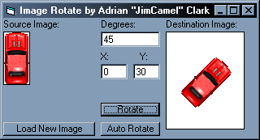



## Rotate Images in PictureBoxes

### Description

Rotates an image in a picture box. The code is fairly well commented, and may be of some use to someone out there.
 
### More Info
 

             |
---                |---
**Submitted On**   |2001-08-02 19:11:46
**By**             |[JimCamel](https://github.com/Planet-Source-Code/PSCIndex/blob/master/ByAuthor/jimcamel.md)
**Level**          |Intermediate
**User Rating**    |5.0 (40 globes from 8 users)
**Compatibility**  |VB 6\.0
**Category**       |[Graphics](https://github.com/Planet-Source-Code/PSCIndex/blob/master/ByCategory/graphics__1-46.md)
**World**          |[Visual Basic](https://github.com/Planet-Source-Code/PSCIndex/blob/master/ByWorld/visual-basic.md)
**Archive File**   |[Rotate Ima23938822001\.zip](https://github.com/Planet-Source-Code/jimcamel-rotate-images-in-pictureboxes__1-25764/archive/master.zip)

